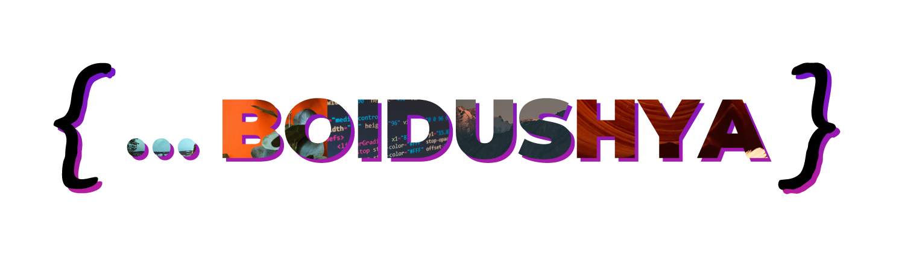

# Hey, there! 

  I'm Boidushya and I love to code weird stuff.
    
  Apart from being an infomaniac, I'm also the most boring person you'll ever know, who could've guessed! <i><b>(/s)</b></i>
    
  You can find me on <a href="https://instagram.com/boidushya">Instagram</a> or <a href="https://linkedin.com/boidushya">LinkedIn</a>!

## 🔧 Technologies & Tools

  
  
  
  
  
  
  
  
  
  
  
  
  

## &#x269B; Language Stats

  

## &#x1F680; GitHub Stats

  
 

## &#128202; Contribution Stats

  
  

## &#x1f4c8; Contribution Graph

  

<!-- links to your social media accounts -->

[1]: https://instagram.com/boidushya
[2]: https://github.com/boidushya
[3]: https://linkedin.com/boidushya

<!-- Resources -->
<!-- Icons: https://simpleicons.org/ -->
<!-- GitHub Stats: https://github.com/anuraghazra/github-readme-stats -->
<!-- Emojis: https://emojipedia.org/emoji/ -->
<!-- HTML Emojis: https://www.fileformat.info/index.htm -->
<!-- Shields: https://shields.io/ -->
<!-- Awesome GitHub Profile README: https://github.com/abhisheknaiidu/awesome-github-profile-readme -->
